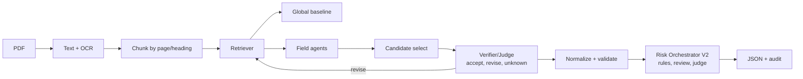
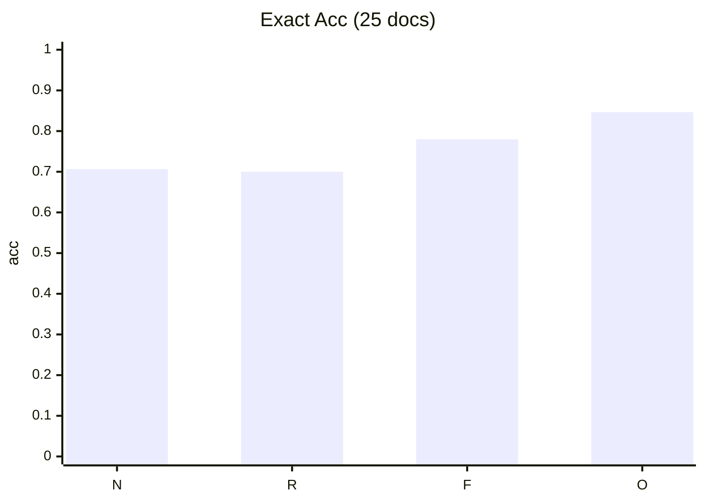
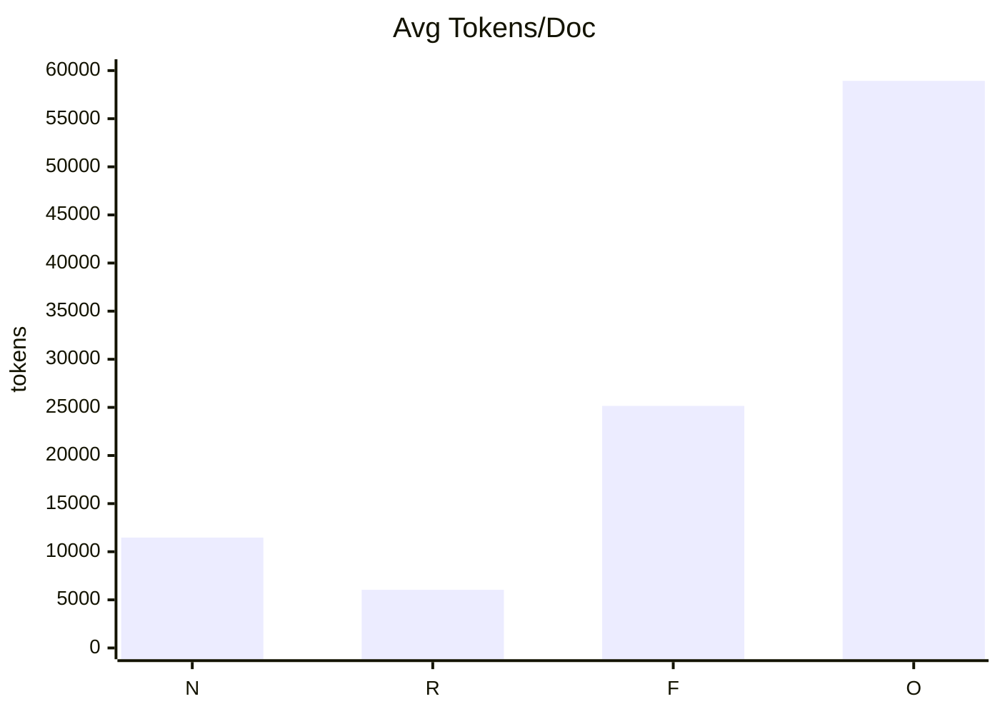

# ContractFlow

Agentic contract extraction from PDF with retrieval, field-level specialists, verifier loops, and auditable post-extraction risk orchestration.

This project is built as a portfolio-grade AI engineering system: not just "one prompt", but a measurable multi-agent pipeline with explicit evidence, confidence, arbitration, and ablations.

## Why This Project

Contract extraction pipelines fail in different ways:

- one-shot prompts miss clause-level details
- retrieval alone can reduce context cost but still mis-extract fields
- high-stakes outputs need verification and deterministic guardrails

ContractFlow addresses this with staged agentic execution and evaluation-first development.

## What Makes It Agentic

1. **Retriever agent**
- Chunks contracts by page/section heading and returns top-k evidence chunks.

2. **Field agents**
- One agent per schema field.
- Each returns `value + evidence snippets + confidence + issues`.

3. **Verifier/Judge agent**
- Decides `accept`, `revise`, or `unknown`.
- Can trigger targeted retrieval + repair passes.

4. **Post-extraction risk orchestrator (v2)**
- Deterministic policy score first, then optional risk-review agent and judge arbitration.
- Full factor trace persisted in `_meta.retrieval.risk`.

## Architecture



## Benchmark Snapshot (Committee Silver, 25 Docs)

Benchmark date: **February 8, 2026**  
Canonical artifact: `data/benchmarks/portfolio_benchmark.json`

| Mode | Exact Accuracy | Partial Accuracy | Exact CI95 | Avg Total Tokens / Doc | Delta Exact vs Naive |
|---|---:|---:|---:|---:|---:|
| naive | 0.7067 | 0.7233 | 0.6733..0.7367 | 11,474 | +0.0000 |
| retrieval | 0.7000 | 0.7067 | 0.6400..0.7533 | 6,038 | -0.0067 |
| field_agents | 0.7800 | 0.7800 | 0.7367..0.8267 | 25,155 | +0.0733 |
| orchestrated | **0.8467** | **0.8567** | **0.8167..0.8800** | 58,935 | **+0.1400** |

### Accuracy Diagram


`N=naive`, `R=retrieval`, `F=field_agents`, `O=orchestrated`

### Token Usage Diagram


`N=naive`, `R=retrieval`, `F=field_agents`, `O=orchestrated`

## Field-Level Signal (Orchestrated Exact Accuracy)

- Strong fields:
  - `doc_type`: 0.96
  - `party_a_name`: 0.96
  - `party_b_name`: 0.96
  - `non_solicit_clause_present`: 1.00
  - `data_transfer_outside_uk_eu`: 1.00
  - `risk_level`: 1.00
- Main bottleneck:
  - `liability_cap`: 0.24
- Secondary bottlenecks:
  - `effective_date`: 0.76
  - `termination_notice_days`: 0.80
  - `risk_explanation`: 0.64

## Risk Engine V2

Implemented in `contractflow/core/risk_engine.py` and the post-extraction orchestration stage in `contractflow/core/extractor.py`, with policy in `docs/risk_policy.json`.

- 3 output classes: `low`, `medium`, `high`
- `risk_level` and `risk_explanation` are derived fields (not directly extracted by the schema prompt)
- weighted factors: liability, governing law region, transfer posture, term, termination, non-solicit
- uncertainty-aware scoring from evidence/confidence coverage
- hard-trigger floors for high-risk combinations
- optional risk-review agent on triggered uncertainty/conflict cases
- optional LLM judge arbitration after deterministic scoring
- normal behavior on uncertainty:
  - missing values remain `unknown`
  - not auto-promoted to `uncapped` or `outside`

Current caveat: committee-silver risk labels are single-class (`high`), so risk-level accuracy is inflated. Add low/medium gold labels for proper calibration.

## Repository Layout

- `contractflow/core/`
  - `pdf_utils.py`: PDF text extraction + OCR fallback
  - `chunking.py`: chunking, BM25/embeddings/hybrid retrieval
  - `extractor.py`: naive/retrieval/field_agents/orchestrated pipelines
  - `risk_engine.py`: policy-driven risk scoring + judge arbitration
- `contractflow/schemas/`
  - `contract_schema.json`
- `contractflow/ui/`
  - `app.py`: FastAPI service for upload, extraction, and risk explainability
  - `templates/index.html`: OpenAI-style minimal UI
  - `static/`: UI CSS + JS
- `scripts/`
  - `baseline_extract.py`, `bulk_extract.py`, `inspect_chunks.py`
  - `run_ui.py`: local web UI launcher
  - `evaluate.py`, `evaluate_risk.py`, `ablation_eval.py`
  - `retrieval_diagnostics.py`, `bootstrap_labels.py`, `build_cuad_pdfs.py`
- `docs/`
  - `domain.md`, `agentic_roadmap.md`, `risk_policy.json`
- `data/`
  - `raw_pdfs/`, `labels/`, `preds_ablations/`, `benchmarks/`

## Quickstart

### 1) Install

```bash
python -m venv .venv
.venv\Scripts\activate
pip install -r requirements.txt
```

Set API key:

```bash
set OPENAI_API_KEY=your_key_here
```

Optional OCR dependencies (for scanned PDFs): Poppler + Tesseract.

### 2) Run One Document

```bash
# Naive
python scripts/baseline_extract.py data/raw_pdfs/nda_harvard.pdf

# Retrieval context
python scripts/baseline_extract.py data/raw_pdfs/nda_harvard.pdf --retrieval

# Field agents
python scripts/baseline_extract.py data/raw_pdfs/nda_harvard.pdf --field-agents

# Orchestrated with verifier/judge
python scripts/baseline_extract.py data/raw_pdfs/nda_harvard.pdf --orchestrated

# Orchestrated with risk-review disabled (rules + judge only)
python scripts/baseline_extract.py data/raw_pdfs/nda_harvard.pdf --orchestrated --disable-risk-review

# Override risk-review model and retrieval depth
python scripts/baseline_extract.py data/raw_pdfs/nda_harvard.pdf --orchestrated --risk-review-model gpt-5.2 --risk-review-top-k 5
```

### 2b) Run The Web UI

```bash
python scripts/run_ui.py --host 127.0.0.1 --port 8000 --reload
```

Open `http://127.0.0.1:8000` and:
- upload a PDF
- choose mode (`naive`, `retrieval`, `field_agents`, `orchestrated`)
- choose retrieval backend (`bm25`, `embeddings`, `hybrid`)
- run extraction and inspect:
  - extracted fields
  - explainable risk summary (drivers, protectors, triggers, uncertainty)
  - orchestration trace

### 3) Reproduce Evaluation

```bash
# Evaluate one mode (with CI95)
python scripts/evaluate.py --labels-dir data/labels --preds-dir data/preds_ablations/orchestrated --label-suffix .silver_committee.json --bootstrap-samples 1000 --out data/benchmarks/eval_orchestrated_committee_latest.json

# Evaluate risk outputs
python scripts/evaluate_risk.py --labels-dir data/labels --preds-dir data/preds_ablations/orchestrated --label-suffix .silver_committee.json --out data/benchmarks/risk_eval_orchestrated_committee_latest.json

# Full ablation report
python scripts/ablation_eval.py --labels-dir data/labels --label-suffix .silver_committee.json --preds-root data/preds_ablations --skip-extraction --bootstrap-samples 1000 --out data/benchmarks/ablation_latest.json
```


## Next High-Impact Improvements

1. Build a **gold risk set** with low/medium/high balance.
2. Improve `liability_cap` extraction with a dedicated clause parser and normalization schema.
3. Add **cost-aware orchestration**: dynamic early-exit when verifier confidence is already high.
4. Add **calibration curves** for field confidence and risk confidence.
